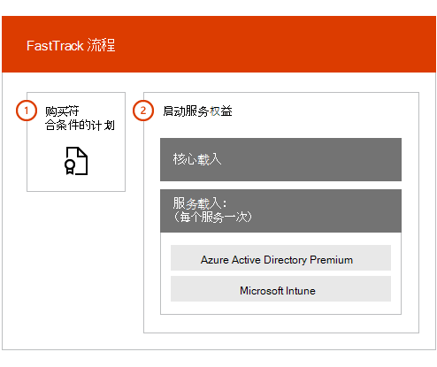

# FastTrack 中心权益概述

借助适用于 Microsoft Azure Active Directory Premium、Microsoft Intune 和 Azure 信息保护的 FastTrack 中心权益，你可以与 FastTrack 专家远程合作，以使你的环境随时可用并计划组织内的推广和使用。 若要了解有关资格的更多信息，请参阅[适用于企业移动性 + 安全性 (EMS) 的 FastTrack 中心权益流程](EMS-fasttrack-process.md)。

载入包括两个主要组件：

-   **核心载入** - 完成租户配置以及与 Azure Active Directory 集成所需执行的任务（如需要）。 核心载入还为载入其他符合条件的 Microsoft 联机服务提供了基线。

-   **服务载入** - 配置 EMS 工作负载（Azure AD Premium、Intune 和 Azure 信息保护）的任何独立变体所需的任务。

下图介绍了 FastTrack 中心权益的高级载入阶段。

以下是流程的工作原理：

- 购买符合条件的服务许可证后，FastTrack 中心会尝试与你联系以提供载入帮助。 如果你已准备好为你的组织部署这些服务，你还可以从 [FastTrack 中心](https://go.microsoft.com/fwlink/?linkid=780698)请求帮助。 若要请求帮助，请使用你的工作或学校帐户登录到 [FastTrack 中心](https://go.microsoft.com/fwlink/?linkid=780698)，转到仪表板，展开页面右下角的**需要帮助吗？** 链接，然后按照提示进行操作以完成你的请求。 在载入启动后，我们便会制定联机会议的日程安排。

-   FastTrack 团队首先为你提供核心功能（对于所有 Microsoft 联机服务都是通用的），然后载入每个符合条件的服务。

所有载入指导均由指定的 FastTrack 人员远程提供：

-   FastTrack 团队会通过组合使用工具、文档和指南来远程帮助你完成各项载入活动。

-   载入指南由 FastTrack 中心提供，对于给定区域，此指南可在正常工作时间内提供。

-   使用繁体中文、简体中文（仅限讲普通话的资源）、英语、法语、德语、意大利语、日语、韩语、葡萄牙语（巴西）、西班牙语、泰语和越南语提供载入协助。

-   FastTrack 团队可以直接与你或你的代表合作。

> [!NOTE]
> **想了解更多信息？** 请参阅[企业移动性 + 安全性](https://www.microsoft.com/cloud-platform/enterprise-mobility)。

## 后续步骤

[适用于 EMS 的 FastTrack 中心权益 - 源环境预期](EMS-source-environment-expectations.md)
