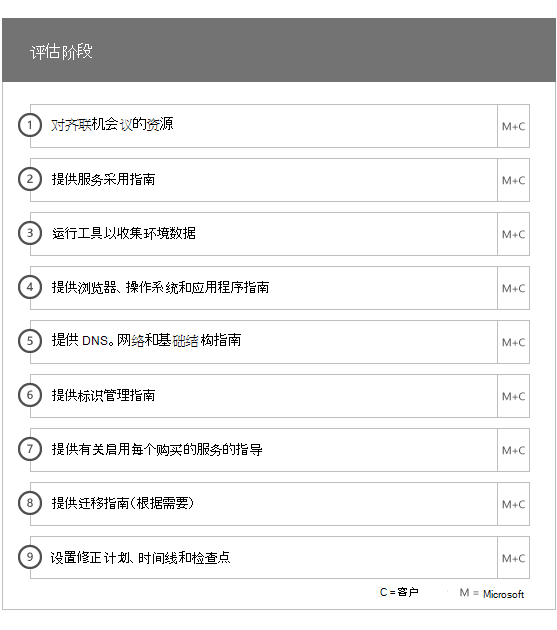
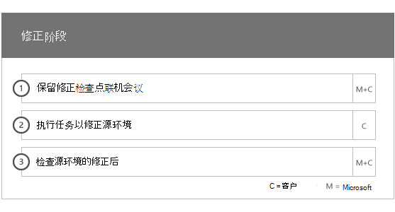
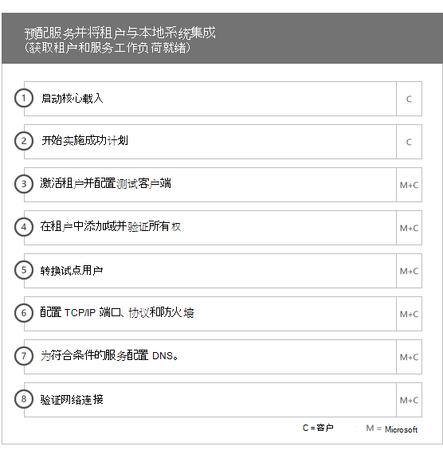
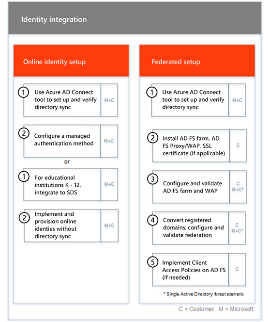
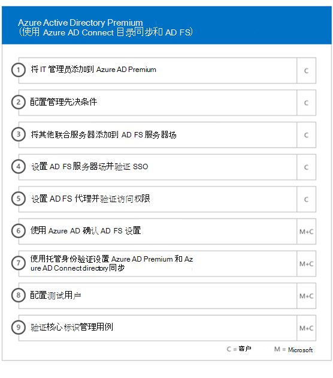
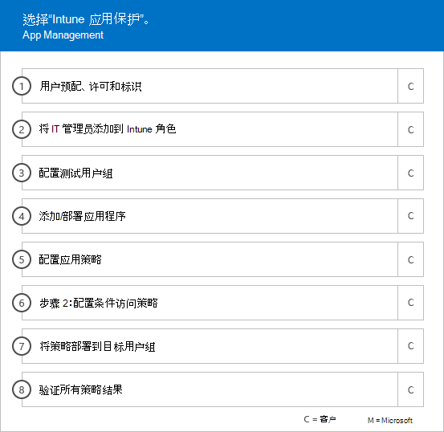
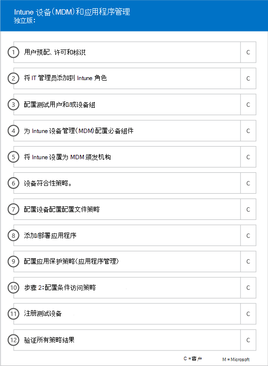
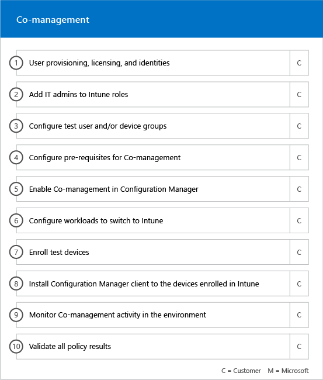

# 载入阶段

使用[符合条件的服务和计划](M365-eligible-services-and-plans.md)以获取可供使用的 Microsoft Azure Active Directory Premium 、Microsoft Intune 和 Azure Information Protection 时，过程中涉及到以下几个阶段。 以下部分介绍了载入流程的每一个阶段。

载入具有四个主要阶段：

## 启动阶段

在购买了正确数量的许可证后，请按照购买确认电子邮件中的指导操作，将许可证与你的现有租户或新租户相关联。 Microsoft 随后将会验证 FastTrack 中心权益是否合格，并尝试联系你以提供载入协助。

> [!NOTE]
> 如果你已准备好为你的组织部署这些服务，你还可以从 [FastTrack 中心](https://go.microsoft.com/fwlink/?linkid=780698)请求帮助。

### 请求协助

1. 登录到 [FastTrack 站点](https://go.microsoft.com/fwlink/?linkid=780698)。
2. 选择“FastTrack”****。
3. 选择“服务”****。
4. 填写**通过 Microsoft 365 请求帮助**表单。

在载入支持启动后，我们便会制定联机会议的日程安排。

Microsoft 合作伙伴也可以客户身份通过 [FastTrack 网站](https://go.microsoft.com/fwlink/?linkid=780698)获取帮助。 为此，请执行以下操作：

1. 登录到 [FastTrack 站点](https://go.microsoft.com/fwlink/?linkid=780698)。
2. 选择“FastTrack”****。
3. 选择“我的客户”****。
4. 搜索你的客户或从你的客户列表中选择。
5. 选择“服务”****。
6. 填写**通过 Microsoft 365 请求帮助**表单。

载入支持开始后，FastTrack 将会为你设置在线会议计划，以讨论载入流程，验证数据和设置启动会议。

## 评估阶段

在载入流程后，FastTrack 中心便会与你一起评估你的源环境和需求。 运行工具以评估你的环境，FastTrack 专家将指导你评估本地 Active Directory、Internet 浏览器、客户端设备的操作系统、域名系统 (DNS)、网络、基础结构和标识系统，以确定是否需要进行任何更改才能载入。

FastTrack 中心还将为你连接有关如何成功推行符合条件的服务的指南。

根据你当前的设置，我们提供了修正计划，此计划可使你的源环境达到成功载入 EMS 或其具体云服务所需达到的最低要求。 我们还会为修正阶段安排适当的检查点通话。

## 修正阶段
你会在源环境内执行修正计划中的任务，以使源环境达到载入和采用每个服务所需达到的要求（视需要）。

在启动启用阶段之前，我们共同验证了修正活动的成果，以确保你符合继续下一阶段的条件。

## 启用阶段
当所有修正活动完成后，项目会转为配置核心基础结构以供服务消耗，并预配每个符合条件的 EMS 云服务。

**启用阶段 - 核心功能**

核心载入涉及服务设置以及租户和身份集成。 此外，它还包括为载入在线服务（如 Azure AD Premium、Intune 和 Azure Information Protection）提供基础的步骤。

> [!NOTE]
> WAP 代表 Web 应用程序代理。SSL 代表安全套接字层。SDS 代表学校数据同步。有关 SDS 的详细信息，请参阅[欢迎使用 Microsoft 学校数据同步](https://go.microsoft.com/fwlink/?linkid=871480)。

> [!NOTE]
> 托管身份验证方法包括但不限于密码哈希同步。 标识集成是一种一次性活动，不包括迁移或停用现有身份验证方法，如托管或联合身份验证。

### 启用阶段 - Azure AD Premium

可以使用 Azure Active Directory Connect 工具目录同步和 Active Directory 联合身份验证服务 (AD FS)（视需要）设置 Azure AD Premium 环境。

对于包括将本地身份同步到云的 Azure AD Premium 方案，我们可以通过以下方式为你提供帮助：将 IT 管理员和用户添加到你的订阅中，配置管理前提条件，设置 Azure AD Premium，使用 Azure AD Connect 工具的托管身份验证和 AD FS 设置目录同步，配置测试用户和为服务验证核心用例。

Azure AD Premium 设置包括启用以下功能：

-   Azure Active Directory 自助密码重置 (SSPR)。

-   Azure 多重身份验证 (Azure MFA)。

-   在 [Azure Active Directory 应用商店](https://azure.microsoft.com/marketplace/active-directory/)中，通过单一登录 (SSO) 实现高达三 (3) 个或更多软件即服务 (SaaS) 应用程序集成。

-   针对[应用集成教程列表](https://docs.microsoft.com/zh-CN/azure/active-directory/saas-apps/tutorial-list)中列出的预集成 SaaS 应用程序进行自动用户预配，仅限于出站配置。

-   自定义登录屏幕，包括徽标、文本和图像。

-   自助服务和动态组（组）。

-   Azure Active Directory 应用程序代理。

-   Azure Active Directory Connect Health。

-   Azure Active Directory 条件访问。

-   Azure Active Directory 使用条款。

-   Azure Active Directory Identity Protection。

-   Azure Active Directory Privileged Identity Management。

-   Azure Active Directory 访问审查。

### 启用阶段 - Intune

对于 Intune，我们将会指导你做好使用 Microsoft Intune 以管理设备的准备。 具体步骤取决于你的源环境，并且基于你的移动设备和移动应用管理需求。 所包含的具体步骤如下：

-   许可最终用户。 我们还可以就如何为 Microsoft 云服务租户激活批量许可证提供协助（视需要）。

-   通过利用本地 Active Directory 或云标识，配置供 Intune 使用的标识。

-   将 Intune 订阅添加到用户，定义 IT 管理角色并创建用户和设备组。

-   根据管理需求配置移动设备管理 (MDM) 颁发机构，包括：

    -   如果 Intune 是唯一的 MDM 解决方案或者与 Office 365 中的移动设备管理结合使用时，请将 Intune 设置为 MDM 颁发机构。

-   为以下操作提供 MDM 指南:

    -   配置用于验证 MDM 管理策略的测试组。

    -   配置 MDM 管理策略和服务，如：

        -   通过 Web 链接或深度链接为每个受支持的平台部署应用程序。

        -   条件访问策略。

        -   部署电子邮件、无线网络和虚拟专用网络 (VPN) 配置文件（如果你的组织中具有现有证书颁发机构、Wi-Fi 或 VPN 基础结构）。

        -   设置 Microsoft Intune Exchange 连接器（如果适用）。

        -   连接到 Intune 数据仓库

        -   将 Intune 与以下内容进行集成：
            -   用于远程协助的 Team Viewer（需要 Team Viewer 订阅）。

            -   移动威胁防护 (MTD) 合作伙伴解决方案（需要移动威胁防护订阅）。

            -   电信费用管理解决方案（需要电信费用管理解决方案订阅）。

            -   Windows Defender 高级威胁防护（需要 Windows E5 或 Microsoft 365 E5 许可证）。

    -   将每个[受支持平台](https://technet.microsoft.com/library/dn600287.aspx)的设备注册到 Intune。

-   为以下操作提供应用程序保护指导:

    -   为每个受支持的平台配置应用保护策略。

    -   为托管应用配置条件访问策略。

    -   使用以上 MAM 策略定向相应的用户组。

    -   使用托管应用程序使用情况报告。

-   为以下操作提供电脑管理指南:

    -   安装 Intune 客户端软件（如果需要）。

    -   使用 Intune 中提供的软件和硬件报告。

    > [!IMPORTANT]
    > FastTrack 不支持通过 Intune 进行 Windows 10 经典电脑管理。 FastTrack 仅支持通过 Intune 移动设备管理 (MDM) 进行 Windows 10 设备管理。

#### Windows Autopilot

FastTrack 可以为最终用户提供新设备而无需构建、维护和应用自定义操作系统图像至你的设备，通过 Windows Autopilot 和 Intune 帮助你检查设备预配。

FastTrack 支持以下 Autopilot 方案:

- **Azure AD 自助服务：** 设备加入 Azure AD 并注册到 Intune。 此方案在使用 Windows 10 1703 和最新版本时受支持。

- **混合 AAD 自助服务：** 设备加入本地 AD 和 Azure AD 并注册到 Intune。 此方案在使用 Windows 10 1809 和最新版本时受支持。

- **自动预配：** 设备自动加入 Azure AD。 此方案在使用 Windows 1809 和最新版本时受支持。

    > [!IMPORTANT]
    > FastTrack 不支持从 Configuration Manager 发起 Autopilot 方案。

设置 Windows Autopilot 的步骤取决于源环境，它可能包括：

- 配置和设置用于 Windows Autopilot 的 Microsoft Intune。

- 配置 Azure AD 动态组

- 将公司品牌添加到 Azure AD。

- 创建设备并将其分配给 Windows Autopilot 配置文件（例如限制本地管理员帐户创建的 Windows Autopilot 配置文件）。

- 定制开箱即用体验 (OOBE) 以符合组织的要求。

- 在 Azure AD 和 Intune 中配置 MDM 自动注册。

#### 安全地部署 Outlook for iOS 和 Outlook for Android

FastTrack 可帮助你在组织中安全地部署 Outlook for iOS 和 Outlook for Android，以确保你的用户安装了所有所需的应用程序。

使用 Intune 安全地部署 Outlook Mobile for iOS 和 Outlook Mobile for Android 的步骤取决于源环境，它可能包括：

- 通过 Apple App Store 或 Google Play Store 下载 Outlook for iOS 和 Outlook for Android、Microsoft Authenticator 和 Intune 公司门户应用程序。
- 此外，还提供设置指南：
    - Outlook for iOS 和 Outlook for Android,、Microsoft Authenticator 和 Intune 公司门户应用程序部署及 Intune。
    - 应用程序保护策略
    - 条件访问策略
    - 应用程序配置策略

    > [!IMPORTANT]
    > FastTrack 团队不支持使用 Exchange 移动设备和邮箱策略保护 Outlook for iOS 和 Outlook for Android。

#### 协同管理

FastTrack 将指导你做好准备，以便使用 Configuration Manager 和 Intune 并发管理 Windows 10 设备。 具体步骤取决于源环境，它可能包括：

- 解释协同管理的好处。

- 为最终用户进行许可。 FastTrack 还可以就如何为 Microsoft 云服务租户激活批量许可证提供协助（视需要）。

- 通过利用本地 Active Directory 和/或云标识，配置供 Intune 使用的标识。

- 将 Intune 订阅添加到用户，定义 IT 管理角色并创建用户和设备组。

- 提供有关如何将与 System Center Configuration Manager（混合）集成的 Intune 移至单独的 Intune 的指南。

- 提供有关为 MDM 自动注册设置 Azure Active Directory 的指南。

- 提供设置混合的 Azure Active Directory 加入的指南。

- 提供有关如何设置云管理网关的指南

- 在 Configuration Manager 控制台中启用协同管理。

- 配置要切换到 Intune 的受支持工作负载。

- 在 Intune 注册的设备中安装 Configuration Manager 客户端。

- 提供有关如何监视环境中的协同管理活动的指南。

FastTrack 还为你提供了有关如何成功推行符合条件的服务的指南。

#### 启用阶段 - Azure 信息保护

为客户提供了以下操作的指南： 

- 激活并配置其租户。
- 创建和设置标签和策略。
- 向文档应用信息保护。 
- 自动对在 Windows 上运行的 Office 应用（如Word、PowerPoint、Excel 和 Outlook）中的信息进行分类和标记，并使用 Azure 信息保护客户端。
- 使用带有 Azure 信息保护扫描程序的静态文件。
- 使用 Exchange Online 邮件流规则监视传输中的电子邮件。

向希望使用 Microsoft Azure 权限管理服务 (Azure RMS)、Office 365 邮件加密 (OME) 和数据丢失防护 (DLP) 应用保护的客户提供指导。

> [!NOTE]
> **想了解更多信息？** 请参阅[企业移动性 + 安全性](https://www.microsoft.com/zh-CN/cloud-platform/enterprise-mobility)。

## 后续步骤

[适用于 EMS 的 FastTrack 权益 - Microsoft 责任](EMS-fasttrack-responsibilities.md)
