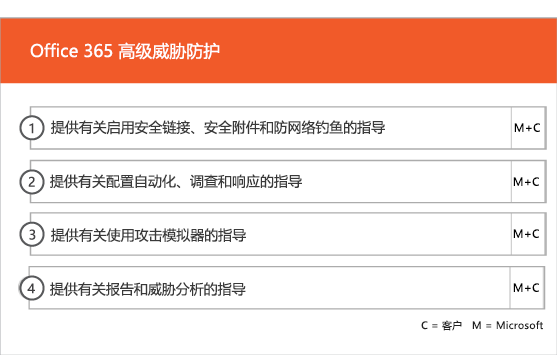
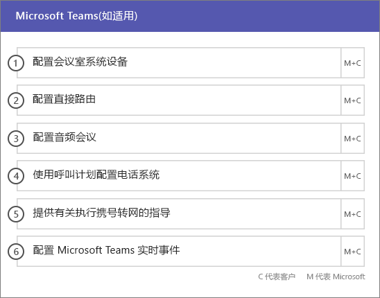

# 载入和迁移阶段Onboarding and Migration Phases

> [!CAUTION]
> 此内容已不再是最新的，且已计划删除。This content is no longer current and is scheduled for removal. 使用左侧导航栏中的目录可查看最新内容。Use the table of contents in the left-hand navigation for current content.

Office 365 载入分为四个主要阶段：启动、评估、修正和启用。可以遵循这些阶段以及下图所示的可选数据迁移阶段。Office 365 onboarding has four primary phases—Initiate, Assess, Remediate, and Enable. You can follow these phases with an optional data migration phase as shown in the following figure.
  

  
> [!NOTE]
>有关载入和迁移 Office 365 美国政府版的信息，请参阅[载入和迁移 Office 365 美国政府版](US-Gov-appendix-onboarding-and-migration.md)。For information on onboarding and migration for Office 365 US Government, see [Onboarding and Migration for Office 365 US Government](US-Gov-appendix-onboarding-and-migration.md). 

有关每个阶段的具体任务，请参阅 [FastTrack 责任](O365-fasttrack-responsibilities.md)和[你的责任](O365-your-responsibilities.md)。For detailed tasks for each phase, see [FastTrack Responsibilities](O365-fasttrack-responsibilities.md) and [Your Responsibilities](O365-your-responsibilities.md).
  
## 启动阶段Initiate phase

在购买了正确数量和类型的许可证后，请按照购买确认电子邮件中的指导操作，将许可证与你的现有租户或新租户相关联。After you purchase the appropriate number and types of licenses, follow the guidance from the purchase confirmation email to associate the licenses to your existing or new tenant. 
  
可以通过 [Microsoft 365 管理中心](https://go.microsoft.com/fwlink/?linkid=2032704)或 [FastTrack 站点](https://go.microsoft.com/fwlink/?linkid=780698)获得帮助。You can get help through the [Microsoft 365 admin center](https://go.microsoft.com/fwlink/?linkid=2032704) or the [FastTrack site](https://go.microsoft.com/fwlink/?linkid=780698). 

若要通过 [Microsoft 365 管理中心](https://go.microsoft.com/fwlink/?linkid=2032704)获取帮助，管理员需登录到管理中心，然后单击“需要帮助吗?”向导。To get help through the [Microsoft 365 admin center](https://go.microsoft.com/fwlink/?linkid=2032704), your admin signs into the admin center and then clicks the **Need help?** widget. 

通过 [FastTrack 站点](https://go.microsoft.com/fwlink/?linkid=780698)获取帮助：To get help through the [FastTrack site](https://go.microsoft.com/fwlink/?linkid=780698): 
1.    登录到 [FastTrack 站点](https://go.microsoft.com/fwlink/?linkid=780698)。Sign in to the [FastTrack site](https://go.microsoft.com/fwlink/?linkid=780698). 
2.    在登录页面顶部的 **快速操作** 中选择 **请求Microsoft 365 的协助** 。Select **Request assistance with Microsoft 365** from the **quick actions** on the top of your landing page.
3.    完成 **请求Microsoft 365 的协助** 表单。Complete the **Request Assistance with Microsoft 365** form.
  
合作伙伴也可以客户身份通过 [FastTrack 网站](https://go.microsoft.com/fwlink/?linkid=780698)获取帮助。若要执行此操作：Partners can also get help through the [FastTrack site](https://go.microsoft.com/fwlink/?linkid=780698) on behalf of a customer. To do so:
1.    登录到 [FastTrack 站点](https://go.microsoft.com/fwlink/?linkid=780698)。Sign in to the [FastTrack site](https://go.microsoft.com/fwlink/?linkid=780698). 
2.    在登录页面顶部的 **快速操作** 中选择 **请求Microsoft 365 的协助** 。Select **Request assistance with Microsoft 365** from the **quick actions** on the top of your landing page.
3.    通过输入客户名称、域名或TPID搜索客户。Search for your customer by entering the customer name, domain, or TPID.
4.    在搜索结果中选择客户。Select customer from the search results.
5.    完成 **请求Microsoft 365 的协助** 表单。Complete the **Request Assistance with Microsoft 365** form.

也可以从为租户提供的服务列表中的 [FastTrack 站点](https://go.microsoft.com/fwlink/?linkid=780698)寻求 FastTrack 中心帮助。You can also ask for FastTrack Center help from the [FastTrack site](https://go.microsoft.com/fwlink/?linkid=780698) in the list of available services for your tenant. 
    
在这一阶段，我们讨论入门流程并验证数据，同时创建启动会议。这包括与你一起了解打算如何使用服务和组织的目标和计划来推动服务使用。During this phase, we discuss the onboarding process, verify your data, and set up a kickoff meeting. This includes working with you to understand how you intend to use the service and your organization's goals and plans to drive service usage.
  

  
## 评估阶段Assess phase

FastTrack 经理会与您和您的采用团队进行一次交互式成功计划通话。这会向您介绍您所购买的符合条件的服务的功能、成功所需要的关键基础、促进服务使用率的方法以及您可用于从服务中获取价值的方案。我们会为您的成功计划提供帮助，并在关键方面提供反馈（根据需要）。Your FastTrack Manager conducts an interactive success planning call with you and your adoption team. This introduces you to the capabilities of the eligible services you purchased, the key foundations you need for success, the methodology for driving usage of the service, and scenarios you can use to get value from the services. We assist you in success planning and provide feedback on key areas (as needed).
  
FastTrack 专家会与你一起评估你的源环境和需求。我们会提供可助你收集你的环境数据的工具，并指导你如何估计带宽需求，以及如何评估你的 Internet 浏览器、客户端操作系统、域名系统 (DNS)、网络和基础结构，还会帮你进行系统确认以确定是否需要为载入进行任何更改。FastTrack Specialists work with you to assess your source environment and the requirements. We provide tools for you to gather data about your environment and  guide you through estimating bandwidth requirements and assessing your internet browsers, client operating systems, Domain Name System (DNS), network, infrastructure, and identity system to determine if any changes are required for onboarding. 
  
根据您当前的设置，我们提供了修正计划，此计划可使您的源环境达到成功载入 Office 365 以及成功迁移邮箱和/或数据（如有必要）所需达到的最低要求。我们提供一套建议活动以增加最终用户价值和采用。我们还为修正阶段安排了适当的检查点通话。Based on your current setup, we provide a remediation plan that brings your source environment up to the minimum requirements for successful onboarding to Office 365 and, if needed, for successful mailbox and/or data migration. We provide a set of suggested activities to increase end user value and adoption. We also set up appropriate checkpoint calls for the Remediate phase.
  

  
## 修正阶段Remediate phase

您基于您的源环境执行修正任务，以便您满足载入、采用和迁移每个服务所需的要求。You do the remediation tasks based on your source environment so that you meet the requirements for onboarding, adopting, and migrating each service as needed.
  

  
我们还提供一套建议活动，以增加最终用户价值和采用。在启动启用阶段之前，我们共同验证了修正活动的成果，以确保您符合继续下一阶段的条件。We also provide a set of suggested activities to increase end user value and adoption. Before beginning the Enable phase, we jointly verify the outcomes of the remediation activities to make sure you're ready to proceed. 
  
在此阶段中，你的 FastTrack 经理会与你一起制定成功计划，指导你选择合适的资源和最佳做法，来提供使该服务适用于你的组织并推动跨服务使用率的指导。During this phase, your FastTrack Manager works with you on success planning, guiding you to the right resources and best practices to provide guidance for you to make the service available to your organization and drive usage across the services.
  
## 启用阶段Enable phase

当所有修正活动完成后，重点会转为配置服务占用的核心基础结构、预配 Office 365 和执行推行服务采用的相关活动。When all remediation activities are complete, the focus shifts to configuring the core infrastructure for service consumption, provisioning Office 365, and conducting the activities to drive service adoption. 
  
## 核心Core

核心载入涉及服务预配以及租户和身份集成。它还包括为载入服务提供基础所要采取的步骤，例如 Exchange Online、SharePoint Online 和 Skype for Business Online。你和你的 FastTrack 经理会继续进行成功计划检查点会议以针对你的目标来评估进展情况，并确定后续需要何种帮助。Core onboarding involves service provisioning and tenant and identity integration. It also includes steps for providing a foundation for onboarding services like Exchange Online, SharePoint Online, and Skype for Business Online. You and your FastTrack Manager continue to have success planning checkpoint meetings to evaluate progress against your goals and determine what further assistance you need.
  

  

  
> [!NOTE]
> WAP 代表 Web 应用程序代理。SSL 代表安全套接字层。SDS 代表学校数据同步。有关 SDS 的详细信息，请参阅[欢迎使用 Microsoft 学校数据同步](https://go.microsoft.com/fwlink/?linkid=871480)。WAP stands for Web Application Proxy. SSL stands for Secure Sockets Layer. SDS stands for School Data Sync. For more information on SDS, see [Welcome to Microsoft School Data Sync](https://go.microsoft.com/fwlink/?linkid=871480). 
  
在核心载入完成后，便可以开始载入一个或多个符合条件的服务。Onboarding for one or more eligible services can begin once core onboarding is finished.
  
## Exchange OnlineExchange Online

对于 Exchange Online，我们会全程指导你，直到你的组织可以使用电子邮件为止。具体步骤视你的源环境和电子邮件迁移计划而定，可以包括为以下内容提供指导：For Exchange Online, we guide you through the process to get your organization ready to use email. The exact steps, depending on your source environment and your email migration plans, can include providing guidance for:
- 为 Office 365 中验证的所有启用邮件的域设置 Exchange Online Protection (EOP) 功能。Setting up Exchange Online Protection (EOP) features for all mail-enabled domains validated in Office 365.
    > [!NOTE]
    > 你的邮件交换 (MX) 记录必须指向 Office 365。Your mail exchange (MX) records must point to Office 365. 
- 设置 Office 365 高级威胁防护 (ATP) 功能（如果它属于订阅服务）。Setting up the Office 365 Advanced Threat Protection (ATP) feature if it's part of your subscription service. 有关详细信息，请参阅 [Office 365 高级威胁防护](#office-365-advanced-threat-protection)。For more information, see [Office 365 Advanced Threat Protection](#office-365-advanced-threat-protection).
- 为在 Office 365 中验证的所有已启用邮件的域设置数据丢失防护 (DLP) 功能，将其作为订阅服务的一部分。这可在 MX 记录指向 Office 365 后完成。Setting up the data loss prevention (DLP) feature for all mail-enabled domains validated in Office 365 as part of your subscription service. This is done once your MX records point to Office 365.
- 为在 Office 365 中验证的所有已启用邮件的域设置 Office 365 邮件加密 (OME) ，将其作为订阅服务的一部分。这可在 MX 记录指向 Office 365 后完成。Setting up Office 365 Message Encryption (OME) for all mail-enabled domains validated in Office 365 as part of your subscription service. This is done once your MX records point to Office 365.

> [!NOTE]
> 邮箱复制服务 (MRS) 尝试将用户本地邮箱中的 Information Rights Managed (IRM) 电子邮件迁移到相应的 Exchange Online 邮箱。The Mailbox Replication service (MRS) attempts to migrate Information Rights Managed (IRM) emails from your on-premises mailbox to the corresponding Exchange Online mailbox. 可读取受保护内容迁移后的能力取决于客户映射和将 Active Directory Rights Managed Services (AD RMS) 模板复制到 Azure Rights Management Service (Azure RMS)。Ability to read the protected content post-migration depends on the customer mapping and copying Active Directory Rights Managed Services (AD RMS) templates to the Azure Rights Management Service (Azure RMS).

- 配置防火墙端口。Configuring firewall ports.
- 设置 DNS，包括所需的自动发现、发件人策略框架 (SPF) 和 MX 记录（根据需要）。Setting up DNS, including the required Autodiscover, sender policy framework (SPF), and MX records (as needed). 
- 设置源邮件环境和 Exchange Online 之间的电子邮件流（根据需要）。Setting up email flow between your source messaging environment and Exchange Online (as needed).
- 执行从源邮件环境到 Office 365 的邮件迁移。Undertaking mail migration from your source messaging environment to Office 365.
- 配置邮箱客户端（Outlook for Windows、Outlook 网页版以及 Outlook for iOS 和 Outlook for Android）。Configuring mailbox clients (Outlook for Windows, Outlook on the web, and Outlook for iOS and Android).
    > [!NOTE]
    > 有关邮件和数据迁移的详细信息，请参阅[数据迁移](O365-data-migration.md)。For more information on mail and data migration, see [Data Migration](O365-data-migration.md). 
  

  
## SharePoint Online 和 OneDrive for BusinessSharePoint Online and OneDrive for Business

对于 SharePoint Online 和 OneDrive for Business，我们提供针对以下方面的指导：For SharePoint Online and OneDrive for Business, we provide guidance for:
- 设置 DNS。Setting up DNS.
- 配置防火墙端口。Configuring firewall ports.
- 设置用户和许可证。Provisioning users and licenses.   
- 配置 SharePoint 混合功能，如混合搜索、混合网站、混合分类、内容类型、混合自助式网站创建（仅适用于 SharePoint Server 2013）、扩展的应用启动器、混合 OneDrive for Business 和 Extranet 网站。Configuring SharePoint hybrid features, like hybrid search, hybrid sites, hybrid taxonomy, content types, hybrid self-service site creation (SharePoint Server 2013 only), extended app launcher, hybrid OneDrive for Business, and extranet sites.
    
FastTrack 专家综合使用工具和文档，以及在适用和可行的情况下执行配置任务，提供有关将数据迁移到 Office 365 的指导。FastTrack Specialists provide guidance on data migration to Office 365 by using a combination of tools and documentation and by performing configuration tasks where applicable and feasible.
  

  
## OneDrive for BusinessOneDrive for Business

对于 OneDrive for Business，具体步骤取决于你目前是否在使用 SharePoint 以及所使用的版本。For OneDrive for Business, the steps depend on if you're currently using SharePoint, and if so, which version. 
  

  
## Office 365 高级威胁防护Office 365 Advanced Threat Protection

对于 Office 365 ATP，我们提供针对以下方面的指导：For Office 365 ATP, we provide guidance for:
- 启用安全链接、安全附件和防钓鱼。Enabling Safe Links, Safe Attachments, and anti-phishing. 
- 配置自动化、调查和响应。Configuring automation, investigation, and response.
- 使用攻击模拟器。Using Attack Simulator.
- 报告和威胁分析。Reporting and threat analytics.

## Microsoft 信息管控Microsoft Information Governance

对于 Microsoft 信息管控，我们将提供以下方面的指导：For Microsoft Information Governance, we provide guidance for:

- 信息管控。Information governance.
- 保留标签和策略。Retention labels and policies.
- 记录管理。Records management.
- 删除策略。Deletion policies.
- 通信合规性。Communication compliance.
- 内部风险管理Insider risk management 
- 高级电子数据展示。Advanced eDiscovery.

## Microsoft 信息保护Microsoft Information Protection

对于 Microsoft 信息保护，我们将提供以下方面的指导：For Microsoft Information Protection, we provide guidance for:
- 通过内容浏览器和活动浏览器了解你的数据。Know your data through content explorer and activity explorer.
- 敏感度标签。Sensitivity labels.
- 数据分类。Data classification.
- 针对 Microsoft Teams 聊天和频道的数据丢失防护 (DLP) 策略。Data loss protection (DLP) policies for Microsoft Teams chats and channels.
- 信息保护。Information protection.
- 统一标记。Unified labeling.

## Microsoft TeamsMicrosoft Teams

对于 Microsoft Teams，我们提供针对以下方面的指导：For Microsoft Teams, we provide guidance for:
- 确认最低要求。Confirming minimum requirements.  
- 配置防火墙端口。Configuring firewall ports.   
- 设置 DNS。Setting up DNS. 
- 确认是否已在 Office 365 租户上启用 Microsoft Teams。Confirming Microsoft Teams is enabled on your Office 365 tenant.  
- 启用或禁用用户许可证。Enabling or disabling user licenses.
    

## Skype for Business OnlineSkype for Business Online

对于 Skype for Business Online，我们提供针对以下方面的指导：For Skype for Business Online, we provide guidance for:
- 配置防火墙端口。Configuring firewall ports.
- 设置 DNS。Setting up DNS.   
- 创建任何聊天室系统设备的帐户。Creating accounts for any room system devices.   
- 部署支持的 Skype for Business Online 客户端。Deploying a supported Skype for Business Online client.  
- 在本地 Lync 2010、Lync 2013 或 Skype for Business 2015 服务器环境与 Skype for Business Online 租户（如果适用）、通话套餐、Skype 会议直播、电话系统和通话套餐（在可用市场中）之间建立拆分域服务器配置。Establishing split domain server configuration between your on-premises Lync 2010, Lync 2013, or Skype for Business 2015 server environment and Skype for Business Online tenant (if applicable), Calling Plans, Skype Meeting Broadcast, and Phone System and Calling Plans (in available markets).
    

  

  
## Power BIPower BI

对于 Power BI，我们提供针对以下方面的指导：For Power BI, we provide guidance for: 
- 分配 Power BI 许可证。Assigning Power BI licenses.
- 部署 Power BI Desktop 应用。Deploying the Power BI Desktop app.
    
## Project OnlineProject Online

对于 Project Online，我们提供针对以下方面的指导：For Project Online, we provide guidance for:
  
- 验证 Project Online 依赖的基本 SharePoint 功能。Verifying basic SharePoint functionality that Project Online relies on.   
- 向你的租户添加 Project Online 服务（包括向用户添加订阅）。Adding the Project Online service to your tenant (including adding subscriptions to users).  
- 设置企业资源池 (ERP)。Setting up the Enterprise Resource Pool (ERP). 
- 创建你的首个项目。Creating your first project. 
    

  
## Project Online Professional 和 Project Online 高级版Project Online Professional and Project Online Premium

对于 Project Online Professional 和 Project Online 高级版，我们提供针对以下方面的指导：For Project Online Professional and Project Online Premium, we provide guidance for:
- 解决部署问题。Addressing deployment issues.
- 使用 [Microsoft 365 管理中心](https://go.microsoft.com/fwlink/?linkid=2032704)和 Windows PowerShell 分配最终用户许可证。Assigning end-user licenses using the [Microsoft 365 admin center](https://go.microsoft.com/fwlink/?linkid=2032704) and Windows PowerShell.  
- 使用即点即用从 Office 365 门户安装 Project Online 桌面客户端。Installing Project Online Desktop Client from the Office 365 portal using Click-to-Run.
- 使用 Office 365 部署工具配置更新设置。Configuring update settings using the Office 365 Deployment Tool.  
- 为 Project Online 桌面客户端 设置一个现场分发服务器，包括帮助创建 configuration.xml 文件以与 Office 365 部署工具一起使用。Setting up a single on-site distribution server for Project Online Desktop Client, including assistance with the creation of a configuration.xml file for use with the Office 365 Deployment Tool.  
- 将 Project Online 桌面客户端 连接到 Project Online Professional 或 Project Online 高级版。Connecting Project Online Desktop Client to Project Online Professional or Project Online Premium.
    

  
## Yammer EnterpriseYammer Enterprise

对于 Yammer，我们提供有关启用 Yammer Enterprise 服务的指导。For Yammer, we provide guidance for enabling the Yammer Enterprise service.
  
## Microsoft 365 应用版Microsoft 365 Apps

对于 Microsoft 365 应用版，我们提供针对以下方面的指导：For Microsoft 365 Apps, we provide guidance for:
- 解决部署问题。Addressing deployment issues.   
- 使用 [Microsoft 365 管理中心](https://go.microsoft.com/fwlink/?linkid=2032704)和 Windows PowerShell 分配基于最终用户和设备的许可证。Assigning end-user and device-based licenses using the [Microsoft 365 admin center](https://go.microsoft.com/fwlink/?linkid=2032704) and Windows PowerShell. 
- 使用即点即用从 Office 365 门户安装 Microsoft 365 应用版。Installing Microsoft 365 Apps from the Office 365 portal using Click-to-Run.   
- 在 iOS 或 Android 设备上安装 Office Mobile 应用（如 Outlook Mobile、Word Mobile、Excel Mobile 和 PowerPoint Mobile）。Installing Office Mobile apps (like Outlook Mobile, Word Mobile, Excel Mobile, and PowerPoint Mobile) on your iOS or Android devices.   
- 使用 Office 365 部署工具配置更新设置。Configuring update settings using the Office 365 Deployment Tool.   
- 本地或云安装的选择和设置。Selection and setup of a local or cloud installation. 
- 使用 Office 自定义工具或用于配置部署包的本地 XML 创建 Office 部署工具配置 XML。Creation of the Office Deployment Tool configuration XML with the Office Customization Tool or native XML to configure the deployment package.  
- 使用 Microsoft Endpoint Configuration Manager 的部署，包括帮助创建 Microsoft Endpoint Configuration Manager 打包。Deployment using Microsoft Endpoint Configuration Manager, including assistance with the creation of Microsoft Endpoint Configuration Manager packaging.
    

  
## Outlook for iOS 和 Outlook for AndroidOutlook for iOS and Android

对于 Outlook for iOS 和 Outlook for Android，我们提供以下方面的指导：For Outlook for iOS and Android, we provide guidance for:
- 从 Apple App Store 和 Google Play 下载 Outlook for iOS 和 Outlook for Android。Downloading Outlook for iOS and Android from the Apple App Store and Google Play.
- 配置帐户和访问 Exchange Online 邮箱。Configuring accounts and accessing the Exchange Online mailbox.
