# Office 365 美国政府版的载入和迁移阶段

Office 365 载入分为四个主要阶段：启动、评估、修正和启用。可以遵循这些阶段以及下图所示的可选数据迁移阶段。
  
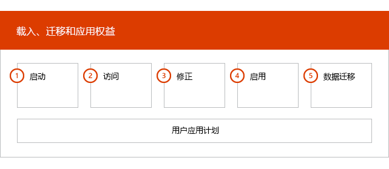
  
有关每个阶段的详细任务, 请参阅 office [365 美国政府版的 FastTrack 责任](US-Gov-appendix-fasttrack-responsibilities.md)和[你对 Office 365 美国政府的责任](US-Gov-appendix-your-responsibilities.md)。
  
## 启动阶段

在购买了正确数量和类型的许可证后，请按照购买确认电子邮件中的指导操作，将许可证与你的现有租户或新租户相关联。 
  
可以通过 [Microsoft 365 管理中心](https://go.microsoft.com/fwlink/?linkid=2032704)或 [FastTrack 站点](https://go.microsoft.com/fwlink/?linkid=780698)获得帮助。 
 
若要通过 [Microsoft 365 管理中心](https://go.microsoft.com/fwlink/?linkid=2032704)获取帮助，管理员需登录到管理中心，然后单击“需要帮助吗?”**** 向导。 

通过 [FastTrack 站点](https://go.microsoft.com/fwlink/?linkid=780698)获取帮助： 
1.  登录到 [FastTrack 站点](https://go.microsoft.com/fwlink/?linkid=780698)。 
2.  选择“FastTrack”****。
3.  选择“服务”****。
4.  完成“通过 Microsoft 365 请求帮助”**** 表单。 

合作伙伴也可以客户身份通过 [FastTrack 网站](https://go.microsoft.com/fwlink/?linkid=780698)获取帮助。若要执行此操作：
1.  登录到 [FastTrack 站点](https://go.microsoft.com/fwlink/?linkid=780698)。 
2.  选择“FastTrack”****。
3.  选择“我的客户”****。
4.  搜索你的客户或从你的客户列表中选择。
5.  选择“服务”****。
6.  完成“通过 Microsoft 365 请求帮助”**** 表单。   

也可以从为租户提供的服务列表中的 [FastTrack 站点](https://go.microsoft.com/fwlink/?linkid=780698)寻求 FastTrack 中心帮助。 
    
在此阶段，我们会讨论载入过程、验证您的数据并安排启动会议。
  
这包括与您一起了解服务的使用方式、您组织的目标和推动服务使用的计划。
  
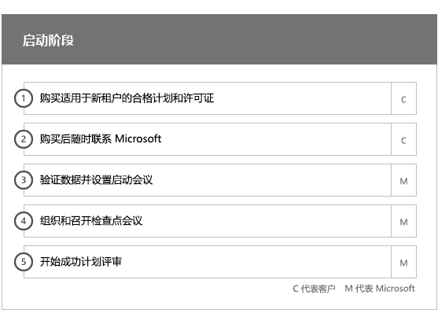
  
## 评估阶段

FastTrack 经理会与您和您的采用团队进行一次交互式成功计划通话。这会向您介绍您所购买的符合条件的服务的功能、成功所需要的关键基础、促进服务使用率的方法以及您可用于从服务中获取价值的方案。我们会为您的成功计划提供帮助，并在关键方面提供反馈（根据需要）。
  
FastTrack 专家与客户一起评估源环境和需求。 我们为您提供了一些工具, 用于收集有关您的环境的数据, 并指导您完成估计带宽要求和评估您的 internet 浏览器、客户端操作系统、域名系统 (DNS)、网络、基础结构和身份系统, 以确定是否需要进行任何更改以进行载入。 
  
根据您当前的设置，我们提供了修正计划，此计划可使您的源环境达到成功载入 Office 365 以及成功迁移邮箱和/或数据（如有必要）所需达到的最低要求。我们提供一套建议活动以增加最终用户价值和采用。我们还为修正阶段安排了适当的检查点通话。
  
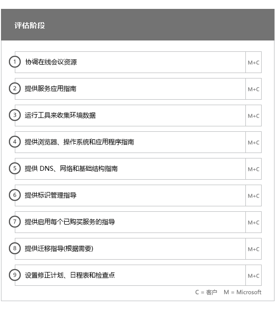
  
## 修正阶段

您基于您的源环境执行修正任务，以便您满足载入、采用和迁移每个服务所需的要求。
  
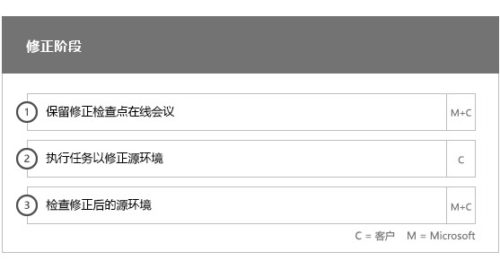
  
我们还提供一套建议活动，以增加最终用户价值和采用。在启动启用阶段之前，我们共同验证了修正活动的成果，以确保您符合继续下一阶段的条件。 
  
在此阶段中，你的 FastTrack 经理会与你一起制定成功计划，指导你选择合适的资源和最佳做法，来提供使该服务适用于你的组织并推动跨服务使用率的指导。
  
## 启用阶段

当所有修正活动完成后，重点会转为配置服务占用的核心基础结构、预配 Office 365 和执行推行服务采用的相关活动。 
  
## 核心

核心载入涉及服务预配以及租户和身份集成。它还包括为载入服务提供基础所要采取的步骤，例如 Exchange Online、SharePoint Online 和 Skype for Business Online。你和你的 FastTrack 经理会继续进行成功计划检查点会议以针对你的目标来评估进展情况，并确定后续需要何种帮助。
  
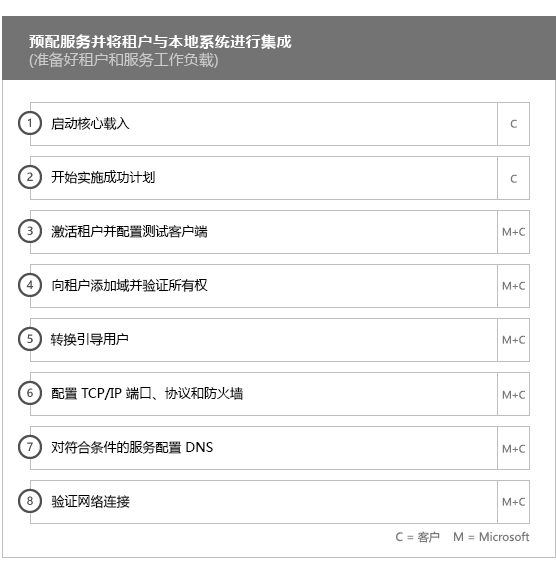
  
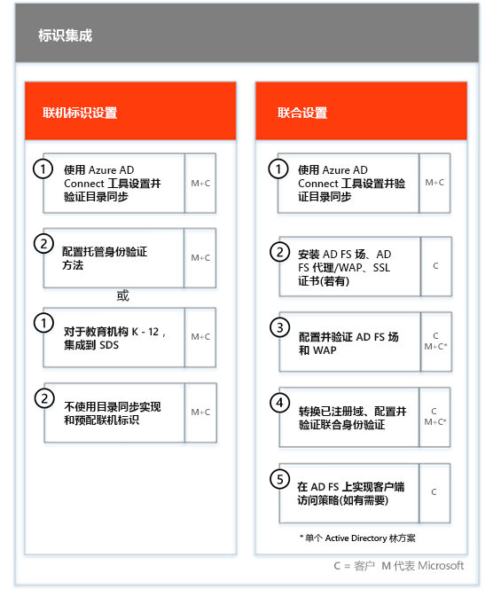
  
> [!NOTE]
> WAP 代表 Web 应用程序代理。SSL 代表安全套接字层。SDS 代表学校数据同步。有关 SDS 的详细信息，请参阅[欢迎使用 Microsoft 学校数据同步](https://go.microsoft.com/fwlink/?linkid=871480)。 
  
在核心载入完成后，便可以开始载入一个或多个符合条件的服务。
  
## Exchange Online

对于 Exchange Online，我们会全程指导你，直到你的组织可以使用电子邮件为止。具体步骤视你的源环境和电子邮件迁移计划而定，可以包括为以下内容提供指导：
  
- 为 Office 365 中验证的所有启用邮件的域设置 Exchange Online Protection (EOP) 功能。   
    > [!NOTE]
    > 你的邮件交换 (MX) 记录必须指向 Office 365。   
- 设置 Exchange Online 高级威胁防护 (ATP) 功能（如果在 MX 记录指向 Office 365 后此功能属于订阅服务的话）。此功能被配置为 Exchange Online Protection 反恶意软件设置的一部分。   
- 配置防火墙端口。   
- 设置 DNS，包括所需的自动发现、发件人策略框架 (SPF) 和 MX 记录（根据需要）。     
- 设置源邮件环境和 Exchange Online 之间的电子邮件流（根据需要）。   
- 执行从源邮件环境到 Office 365 的邮件迁移。   
    > [!NOTE]
    > 有关邮件和数据迁移的详细信息，请参阅[数据迁移](O365-data-migration.md)。 
  
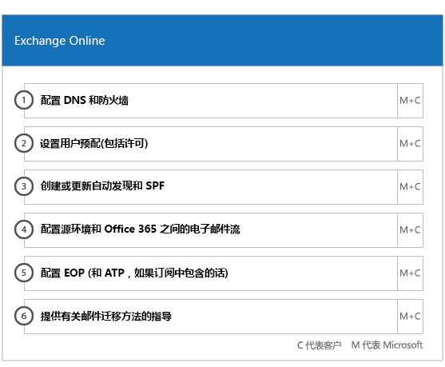
  
## SharePoint Online 和 OneDrive for Business

对于 SharePoint Online 和 OneDrive for Business，我们提供针对以下方面的指导： 
- 设置 DNS。   
- 配置防火墙端口。   
- 设置用户和许可证。   
- 配置 SharePoint 混合功能，如混合搜索、混合网站、混合分类、内容类型、混合自助式网站创建（仅适用于 SharePoint Server 2013）、扩展的应用启动器、混合 OneDrive for Business 和 Extranet 网站。
    
FastTrack 专家综合使用工具和文档，以及在适用和可行的情况下执行配置任务，提供有关将数据迁移到 Office 365 的指导。
  
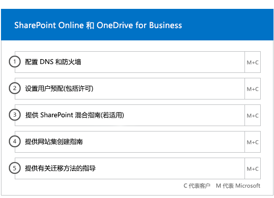
  
## OneDrive for Business

对于 OneDrive for Business，具体步骤取决于你目前是否在使用 SharePoint 以及所使用的版本。 
  
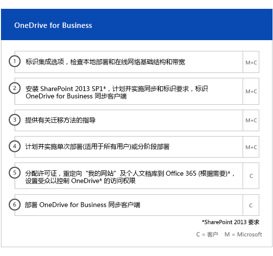
  
## Skype for Business Online

对于 Skype for Business Online，我们提供针对以下方面的指导： 
- 配置防火墙端口。    
- 设置 DNS。    
- 创建任何聊天室系统设备的帐户。    
- 部署支持的 Skype for Business Online 客户端。   
- 在本地 Lync 2010、Lync 2013 或 Skype for Business 2015 server 环境和 Skype for business Online 租户之间建立拆分域服务器配置 (如果适用)。
- 启用通话套餐、Skype 会议直播和电话系统和通话套餐 (在可用市场中-在 GCC 高或 DoD 计划中不可用)。 
    
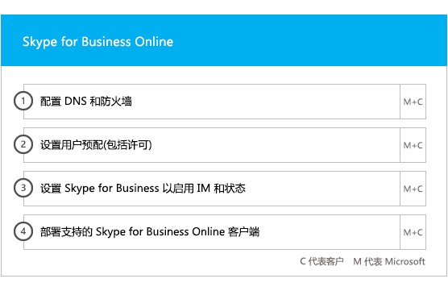
  
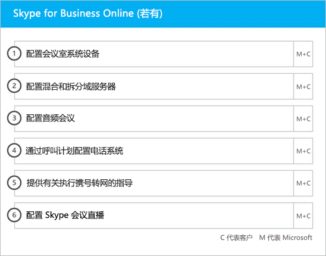
  
## Microsoft Teams

> [!NOTE]
> 以下项在 GCC High 或 DoD 计划中不可用。

对于 Microsoft Teams，我们提供针对以下方面的指导： 
- 确认最低要求。   
- 配置防火墙端口。   
- 设置 DNS。  
- 确认是否已在 Office 365 租户上启用 Microsoft Teams。    
- 启用或禁用用户许可证。
    
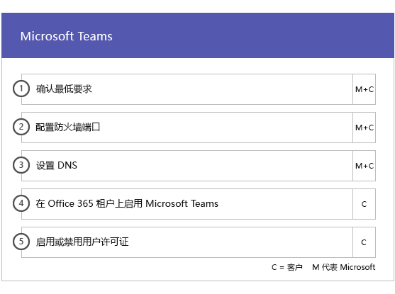
  
## Power BI

对于 Power BI，我们提供针对以下方面的指导：  
- 分配 Power BI 许可证。    
- 部署 Power BI Desktop 应用。   
## Project Online

对于 Project Online，我们提供针对以下方面的指导： 
- 验证 Project Online 依赖的基本 SharePoint 功能。    
- 向你的租户添加 Project Online 服务（包括向用户添加订阅）。    
- 设置企业资源池 (ERP)。   
- 创建你的首个项目。 
    
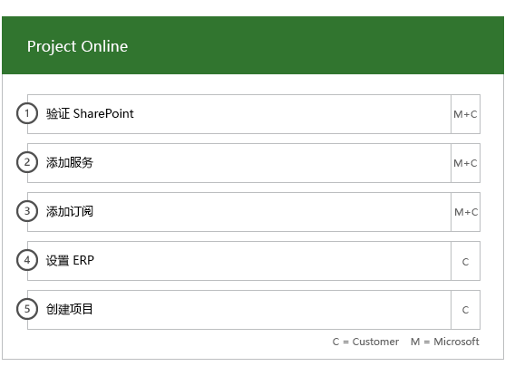
  
## Yammer Enterprise

对于 Yammer，我们提供有关启用 Yammer Enterprise 服务的指导。

> [!NOTE]
> Yammer Enterprise 不是 Office 365 美国政府的一个组件, 但可以免费获取, 作为针对 GCC 中的 Office 365 许可的每个用户的独立提供。 此优惠目前仅限于在企业协议和企业订阅协议下购买 Office 365 GCC 的客户。 Yammer 在 GCC High 或 DoD 计划中不可用。 
  
## Office 365 专业增强版

对于 Office 365 专业增强版，我们提供针对以下方面的指导： 
- 解决部署问题。    
- 使用 [Microsoft 365 管理中心](https://go.microsoft.com/fwlink/?linkid=2032704)和 Windows PowerShell 分配最终用户许可证。    
- 使用即点即用从 Office 365 门户安装 Office 365 专业增强版。    
- 在你的 iOS、Android 或 Windows Mobile 设备上安装 Office Mobile 应用（如 Outlook Mobile、Word Mobile、Excel Mobile 和 PowerPoint Mobile）。   
- 使用 Office 365 部署工具配置更新设置。    
- 为 Office 365 专业增强版设置一个现场分发服务器，包括帮助创建 configuration.xml 文件以与 Office 365 部署工具一起使用。    
- 使用 Microsoft System Center Configuration Manager 的部署，包括帮助创建 System Center Configuration Manager 打包。
    
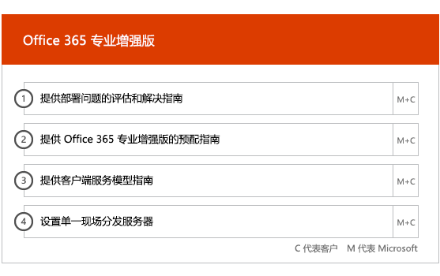

  

  

