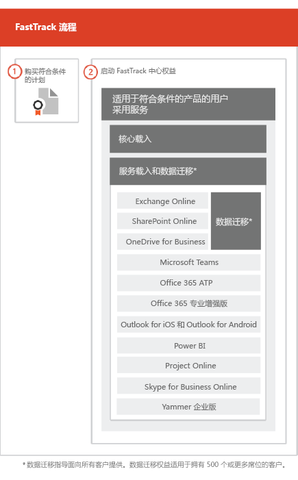

# FastTrack 流程The FastTrack Process

FastTrack 流程提供了载入和用户采用服务。The FastTrack process provides onboarding and user adoption services. 
  
载入包括：Onboarding consists of:
  
- *核心载入*：这些是完成租户配置以及与 Azure Active Directory (Azure AD) 集成所需执行的任务（如需要）。核心载入还为载入其他符合条件的服务提供了基线。*Core onboarding* — These are tasks required for tenant configuration and integration with Azure Active Directory (Azure AD) if needed. Core onboarding also provides the baseline for onboarding other eligible services. 
- *服务载入和迁移*：服务载入任务支持你租户中的方案。数据迁移（包括电子邮件和文件）包含在[数据迁移](data-migration.md)中。*Service onboarding and migration* — Service onboarding tasks enable scenarios in your tenant. Data migration (including email and files) is covered in [Data Migration](data-migration.md). 
    
用户采用服务由多个任务组成，可提供指导以确保你的用户了解符合条件的服务，并可以使用它们推动业务价值。此协助与载入活动并行发生。User adoption services are comprised of tasks that provide guidance for you to ensure your users are aware of the eligible services and can use them to drive business value. This assistance occurs in parallel to onboarding activities.
  
> [!NOTE]
> FastTrack 为客户提供了建议的方法、指南以及经过工程设计旨在交付快速和可预测结果的最佳做法。如果选择不依据本指南进行部署，则载入体验和服务的使用可能会受到影响。指导定义为口头和书面协助的组合。在 FastTrack 专家提供指导时，FastTrack 人员不能以你的名义进行操作。只要订阅是当前订阅，就可以将 FastTrack 服务用于载入并采用任何合格的产品工作负荷。FastTrack provides customers with a recommended approach, guidance, and best practices engineered to deliver quick and predictable outcomes. If you choose to deploy outside of this guidance, your onboarding experience and usage of the service may be impacted. Guidance is defined as a combination of verbal and written assistance. When FastTrack Specialists provide guidance, FastTrack personnel cannot act on your behalf. You can use FastTrack services to onboard and adopt any qualifying product workload as long as your subscription is current. 
  
## 初始启用流程The onboarding process

下图说明了载入流程。The following diagram illustrates the onboarding process.
  

  
可以通过 Office 365 管理中心或 [FastTrack 网站](https://go.microsoft.com/fwlink/?linkid=780698)获取帮助。若要通过 Office 365 管理中心获取帮助，管理员需登录到管理中心并单击" **需要帮助吗?** "向导。若要通过 [FastTrack 网站](https://go.microsoft.com/fwlink/?linkid=780698)获取帮助，请登录并单击" **服务** "，然后完成" **请求 Office 365 帮助** "表单。You can get help through the Office 365 admin center or the [FastTrack site](https://go.microsoft.com/fwlink/?linkid=780698). To get help through the Office 365 admin center, your admin signs into the admin center and then clicks the **Need help?** widget. To get help through the [FastTrack site](https://go.microsoft.com/fwlink/?linkid=780698), sign in, click **Services**, and complete the **Request Assistance for Office 365** form. 
    
> [!NOTE]
>  如果你的 Office 365 租户中列出了一个合作伙伴，将不会看到此选项。请咨询你的合作伙伴以获得帮助。If you have a partner listed in your Office 365 tenant, you won't see this option. Please consult your partner for assistance. 
  
 也可以从为租户的可用服务列表中的 [FastTrack 站点](https://go.microsoft.com/fwlink/?linkid=780698)寻求 FastTrack 中心帮助。You can also ask for FastTrack Center help from the [FastTrack site](https://go.microsoft.com/fwlink/?linkid=780698) in the list of available services for your tenant. 
    
 在载入助手启动后，我们便会制定联机会议的日程安排。Once onboarding assistance starts, we set up a schedule of online meetings.
    
合作伙伴也可以客户身份通过 [FastTrack 网站](https://go.microsoft.com/fwlink/?linkid=780698)获取帮助。若要执行此操作，合作伙伴需登录网站，选择客户记录，单击" **服务** "，并完成" **请求 Office 365 帮助** "表单。Partners can also get help through the [FastTrack site](https://go.microsoft.com/fwlink/?linkid=780698) on behalf of a customer. To do so, the partner signs in to the site, selects the customer record, clicks **Services**, and completes the **Request Assistance for Office 365** form. 

下表列出了流程中的角色和职责。The following table lists roles and responsibilities for the process.
    
|||
|:-----|:-----|
|**角色****Role**   |**职责****Responsibility**   |
|**FastTrack 专家****FastTrack Specialist**   |远程提供所有入门、迁移和用户采用服务。Microsoft provides all onboarding, migration, and user adoption services remotely by assigned Microsoft personnel.    通过综合使用工具和发布的文档远程协助你。Microsoft assists you remotely by using a combination of tools and published documentation.   直接协助你或你的代表。Microsoft can work directly with you or your representative.   提供电子邮件和数据迁移指导。Microsoft provides email and data migration guidance.|
|**FastTrack 中心****FastTrack Center**    |提供核心和服务入门指导，并指导如何计划成功采用符合条件的服务。The FastTrack team provides guidance with core and service onboarding and planning successful adoption of eligible services.    在正常工作时间对特定区域提供协助。The FastTrack_Center provides assistance and is available during normal business hours for a given region.   使用繁体中文、简体中文（仅限讲普通话的资源）、英语、法语、德语、意大利语、日语、韩语、葡萄牙语（巴西）、西班牙语、泰语和越南语提供协助。Assistance is available in Traditional Chinese and Simplified Chinese (resources speak Mandarin only), English, French, German, Italian, Japanese, Korean, Portuguese (Brazil), Spanish, Thai, and Vietnamese.|

  

